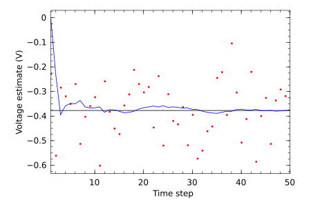
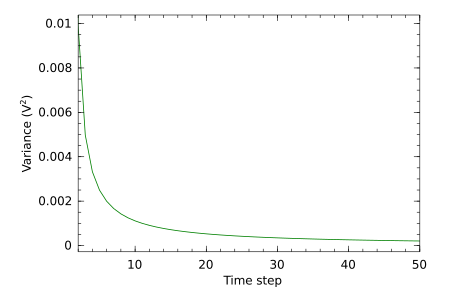

# Kalman

A generic interface for Kalman filters in Julia.

Note that the [TimeModels.jl](https://github.com/JuliaStats/TimeModels.jl) also has an implementation of Kalman filters for time series analysis. This implementation (Kalman.jl) focuses on applications of Kalman filters to online data assimilation problems, and intends to develop a single API for both linear and nonlinear Kalman filters. Kalman.jl is an unregistered package still in active development, so bugs may be common and changes rapid. For a more stable and tested API, check out TimeModels.jl.

## Installation

	Pkg.clone("git://github.com/wkearn/Kalman.jl")

Until this package is registered, simply Pkg.clone from this repository

## Usage

	using Kalman
	
	x0 = State([0.0],[1.0]')
	f = LinearModel([1]',[1]',[1e-10]')
	z = LinearObservationModel([1]',[0.01]')

	kf0 = BasicKalmanFilter(x0,f,z)
	kf = kf0

	y = map(i->Observation([i]),-0.37727+sqrt(0.01)*randn(50))

	x = zeros(Float64,50)
	p = ones(Float64,50)

	for i = 1:49
		kf = predictupdate(kf,y[i])
		x[i+1] = kf.x.x[1]
		p[i+1] = kf.x.p[1]
	end

